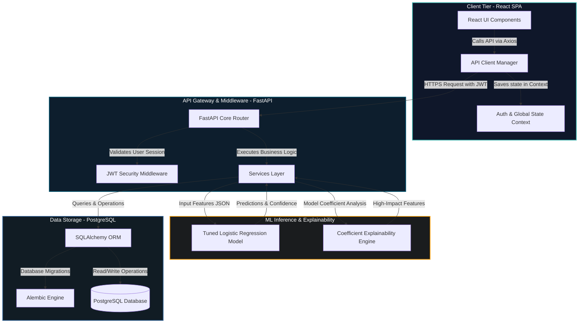

# DropGuard – AI-Powered Student Dropout Prediction System

## Overview

**DropGuard** is a professional, AI-powered student dropout prediction and prevention system designed for schools. By combining machine learning with multi-dimensional student profiling, the system identifies students at risk of dropping out before they disengage, allowing educational institutions to implement timely, targeted interventions.

The system performs the following key functions:
*   **Multi-Dimensional Analysis:** Analyzes student academic performance, attendance records, behavioral attributes, family structure, health indicators, and technology access.
*   **Dropout Risk Prediction:** Computes individual dropout risk scores and classifies students into **Low**, **Medium**, and **High** risk levels.
*   **Probability & Confidence Information:** Provides prediction probability scores and model confidence metrics.
*   **Explainable AI Insights:** Uses model coefficients to explain the primary factors driving each prediction.
*   **Recommendations & Intervention Guidance:** Recommends targeted intervention actions customized to the student's primary risk vectors.
*   **School-Level Analytics:** Computes and displays school-level analytics for administrators, headmasters, and teachers.
*   **Secure Student Management:** Manages student records and profiles within a secure, multi-role directory.

## Problem Statement

Student attrition is a complex educational challenge driven by intersecting academic, behavioral, socio-economic, and accessibility factors. Standard Student Information Systems (SIS) are reactive—they show historical statistics when it is often too late for intervention. Educators and school administrators lack proactive, early-warning tools to recognize at-risk students and coordinate preventive support. DropGuard solves this by providing proactive predictions and actionable insights.

## Objectives

*   **Early Prediction:** Proactively classify student dropout risks using a predictive model.
*   **Preventive Interventions:** Identify specific risk categories early, enabling coordinated school-level support.
*   **Explainable Insights:** Provide transparent, coefficient-based explainable insights to reveal the primary variables driving each prediction.
*   **Data Integration:** Enable easy batch imports of student profiles with validation.
*   **School Isolation & Security:** Enforce role-based access control and school-scoped data isolation.

## Key Features

### Authentication & RBAC
*   **Multi-Role Access Control:** Strict authorization separation for **System Administrators**, **Headmasters**, and **Teachers**.
*   **JWT Authentication:** Secure, stateless session authorization using JSON Web Tokens.
*   **School-Level Data Isolation:** Data access limits ensure staff members only view and manage records belonging to their assigned school.

### Student Management
*   **Student Profiles:** Management of demographics, academics, attendance, behaviors, family, health, and tech attributes.
*   **Roster Updates:** Register, update, and search students within a scoped classroom.
*   **Student Deletion:** Permanent single student deletion by Admin.
*   **Bulk Student Deletion:** Admin-only capability to batch delete student records.
*   **Activity Timeline:** Audit trail tracking student predictions and updates over time.

### AI Prediction
*   **Tuned Logistic Regression:** High-performance binary classifier optimized for student tabular data.
*   **Risk Classification:** Categorizes student dropout risks into Low, Medium, and High levels.
*   **Prediction Probability & Confidence:** Computes probability scores and model confidence metrics for every inference.
*   **Explainable AI (XAI):** Renders the top high-impact factors behind a student's predicted risk score based on model coefficients.
*   **Prediction History:** Tracks historical prediction results to monitor risk changes over time.

### Recommendations
*   **Risk-Factor-Based Intervention Recommendations:** Automatically generates targeted intervention strategies.
*   **Academic Support:** Tailored advice based on failed subjects and low grades.
*   **Attendance Monitoring:** Actionable plans for students with high absences.
*   **Financial Support:** Identifies students requiring aid based on financial difficulty.
*   **Counselling:** Flags behavioral or mental health indicators for counselor engagement.

### Import System
*   **CSV/Excel Student Import:** Batch import student profiles directly from spreadsheets.
*   **Header Mapping:** Dynamic column mapping to database fields in real time.
*   **Dry-Run Validation:** Validates formats, duplicates, and missing details before writing to the database.
*   **Case-Insensitive Yes/No Normalization:** Normalizes boolean/categorical inputs during ingestion.
*   **School-Scoped Importing:** Automatically scopes imports to the user's school.
*   **Import Diagnostics:** Reports errors and warnings on faulty import rows.

### School Management
*   **School Creation:** Admin tools to create and configure educational institutes.
*   **School Dashboard:** Visual dashboards showing student/staff statistics, risk distribution, attendance analytics, and recent activity.
*   **Permanent School Deletion:** Admin-only function to delete schools permanently.
*   **Cascading Deletions:** Deleting a school cascade-deletes all associated students, student records, and non-admin users.

### Reporting
*   **Student/Risk Reports:** Visual charts representing risk demographics and trends.
*   **CSV/Excel Exports:** Download student lists and risk distributions in CSV or Excel format.

## How It Works

```
[Student Data Source] ──> [Smart Import Wizard] ──> [Feature Engineering Layer (24 features)]
                                                                  │
                                                                  ▼
[Explainable AI Engine] <── [Tuned Logistic Regression] <── [Model Pipeline Inference]
          │
          ▼
[High-Impact Risk Factors] ──> [Intervention Recommendations] ──> [Dashboard Visualizations]
```

1.  **Ingestion & Validation:** The Import Wizard maps raw files to database columns, validating data fields during parsing.
2.  **Feature Engineering:** The backend feature engineering layer converts stored student attributes into a normalized 24-feature vector.
3.  **Inference Pipeline:** The prediction service loads the Tuned Logistic Regression model to compute dropout probability, risk level, and prediction confidence.
4.  **Explainability:** The explanation engine maps the model's coefficients back to the student's values, calculating the top 5 factors impacting the risk classification.
5.  **Intervention:** Targeted recommendations are generated based on the highest risk vectors (e.g., high failure counts trigger academic tutoring advice).

## Dataset & ML Features

The dataset contains 25 attributes/columns, consisting of 24 predictive input attributes and one target variable, Dropout_Status.

### Dataset Schema

| # | Attribute | Type/Role | Description |
| :- | :--- | :--- | :--- |
| 1 | `Gender` | Input Feature (Categorical) | Student gender identification (`M` / `F`). |
| 2 | `Age` | Input Feature (Numerical) | Age of the student in years. |
| 3 | `Previous_Year_Percentage` | Input Feature (Numerical) | Overall academic marks percentage achieved in the previous academic year. |
| 4 | `Current_Year_Percentage` | Input Feature (Numerical) | Academic marks percentage in current year assessments. |
| 5 | `Overall_Percentage` | Input Feature (Numerical) | Cumulative average academic performance percentage. |
| 6 | `Number_of_Failures` | Input Feature (Numerical) | Total count of past subject or class failures. |
| 7 | `Number_of_Absences` | Input Feature (Numerical) | Total count of school days missed during the academic term. |
| 8 | `Attendance_Percentage` | Input Feature (Numerical) | Overall percentage of school days attended. |
| 9 | `Attendance_Classification` | Input Feature (Categorical) | Categorized attendance level (e.g., `Poor`, `Moderate`, `Good`, `Excellent`). |
| 10 | `Mother_Education` | Input Feature (Categorical) | Highest educational attainment level of the student's mother. |
| 11 | `Father_Education` | Input Feature (Categorical) | Highest educational attainment level of the student's father. |
| 12 | `Family_Support` | Input Feature (Categorical) | Availability of educational support from family (`Yes` / `No`). |
| 13 | `School_Support` | Input Feature (Categorical) | Extra educational support provided by the school (`Yes` / `No`). |
| 14 | `Internet_Access` | Input Feature (Categorical) | Access to home internet connectivity (`Yes` / `No`). |
| 15 | `Health_Status` | Input Feature (Categorical) | Overall student health assessment (e.g., `Poor`, `Average`, `Good`, `Excellent`). |
| 16 | `Family_Income` | Input Feature (Categorical) | Household income bracket (e.g., `Low`, `Medium`, `High`). |
| 17 | `Financial_Difficulty` | Input Feature (Categorical) | Indicator of household financial struggle (`Yes` / `No`). |
| 18 | `Homework_Completion` | Input Feature (Categorical) | Consistency and quality of homework completion (e.g., `Poor`, `Average`, `Good`). |
| 19 | `Low_Motivation` | Input Feature (Categorical) | Indicator of low academic motivation or disengagement (`Yes` / `No`). |
| 20 | `Mental_Health_Risk` | Input Feature (Categorical) | Identified mental health or emotional well-being risk indicator (`Yes` / `No`). |
| 21 | `Child_Labour_Risk` | Input Feature (Categorical) | Indicator of child labour risk or student working during school years (`Yes` / `No`). |
| 22 | `Computer_Access` | Input Feature (Categorical) | Access to a computer or laptop at home for study (`Yes` / `No`). |
| 23 | `Smartphone_Access` | Input Feature (Categorical) | Availability of a smartphone for educational purposes (`Yes` / `No`). |
| 24 | `Electricity_Availability` | Input Feature (Categorical) | Stable availability of household electricity (`Yes` / `No`). |
| 25 | `Dropout_Status` | Target Variable (Categorical) | Target variable representing student dropout status (`Yes` / `No`). Not used as an input feature. |

### Ingestion & Pipeline Details
*   **Dataset Structure:** The complete dataset contains 25 columns (24 predictive input attributes and 1 target variable: `Dropout_Status`).
*   **Inference Pipeline:** When importing spreadsheets or generating real-time predictions, the ML prediction pipeline uses the **24 input features** to compute dropout risk, while `Dropout_Status` serves strictly as the ground-truth target variable for model evaluation and historical tracking.
*   **Data Validation:** The backend ingestion layer validates, normalizes, and encodes student records into the required 24-feature representation for model inference.

## Machine Learning Model

The current DropGuard system uses a **Tuned Logistic Regression** pipeline, which is optimized for student tabular data.

### Model Architecture & Features
*   **Model Type:** Tuned Logistic Regression (scikit-learn pipeline with preprocessing and scaling)
*   **ML Input Features:** 24 input features
*   **Target Variable:** `Dropout_Status` (target variable, not used as an input feature)
*   **Explainability:** Model coefficients are extracted directly to provide transparent, interpretable risk factor insights for each student.

### Model Artifacts
Trained model artifacts are loaded dynamically by the prediction service:
*   `backend/app/ml/dropguard_model.pkl` — Trained scikit-learn pipeline (preprocessor + classifier).
*   `backend/app/ml/label_encoder.pkl` — Target class label encodings.
*   `backend/app/ml/feature_names.pkl` — Authoritative reference order for the 24 model input features.
*   `backend/app/ml/metrics.json` — Evaluation metrics from validation.

### Verified Model Metrics
*   **Training Dataset Size:** 647 rows
*   **ML Input Features:** 24 features
*   **Target Variable:** `Dropout_Status` (1 target variable)
*   **Accuracy:** 85.32%
*   **ROC-AUC:** 95.93%

*Note: Preprocessing, scaling, and categorical encoding are handled automatically inside the scikit-learn pipeline. Logistic Regression coefficients are used to compute relative feature importance for explainable insights.*

## Tech Stack

### Frontend
*   **React** (Vite build system)
*   **TailwindCSS** (Vanilla CSS configuration)
*   **Axios** (API communications with JWT interceptors)
*   **Framer Motion** (Transitions and loading states)
*   **Lucide React** (Vector iconography)

### Backend
*   **FastAPI** (ASGI Framework)
*   **SQLAlchemy** (ORM database models)
*   **Pydantic** (JSON serialization & validation schemas)
*   **Alembic** (Database migration control)

### Database
*   **PostgreSQL / Neon PostgreSQL** (Relational database storage)

### Machine Learning
*   **Python**
*   **pandas & NumPy** (Data manipulation and linear algebra)
*   **scikit-learn** (Preprocessors and Logistic Regression pipeline)
*   **joblib** (Model serialization)

### Explainability
*   Coefficient-based Logistic Regression explanation implementation.

## System Architecture



## Database

The relational database is designed in PostgreSQL. Relational cascades enforce referential integrity.

### Entities & Tables
*   **`schools`**: Relational registry of schools (District, Block, Village, Type, Medium, Student Strength).
*   **`users`**: central account directory storing full name, credentials, roles, active flags, and school reference.
*   **`students`**: Core registry holding student attributes, demographics, and school reference.
*   **`student_academics`**: Academic marks, failures count, and backlog status.
*   **`student_attendance`**: Term attendance percentage, absences, leave days, and late arrivals.
*   **`student_behaviour`**: Homework completion, participation, classroom feedback, and motivation flags.
*   **`student_family`**: Annual income, parents' education, sibling count, and child labor risk.
*   **`student_health`**: Nutrition status, vision problems, and mental health risks.
*   **`student_technology`**: Availability indices for internet, electricity, smartphones, and computers.
*   **`student_predictions`**: Computed risk tier, probabilities, coefficients, and recommended actions.
*   **`activity_logs`**: System audit records storing user IDs, actions, description, and IP addresses.

### Cascade & Deletion Behaviors
*   **Student Deletion:** Deleting a student deletes related tables (`student_academics`, `student_attendance`, `student_behaviour`, `student_family`, `student_health`, `student_technology`, `student_predictions`) via SQLAlchemy's `delete-orphan` cascades.
*   **School Deletion:** Deleting a school cascade-deletes all associated students, student records, and non-admin users.

## Security & RBAC

*   **JWT Authorization:** Session tokens authenticate and authorize API request endpoints.
*   **Password Hashing:** Passwords are encrypted using the `bcrypt` algorithm.
*   **School-Level Isolation:** Scoped queries filter records, preventing cross-school data visibility.
*   **Auditing:** System events (logins, deletions, updates, imports) are logged with description, timestamp, and client IP.
*   **Parametrized Queries:** Compiled ORM transactions protect the database from SQL Injection.
*   **Deletion Safeguards:** Destructive actions (student deletion, bulk deletes, and school deletion) require Admin credentials.
*   **Environment Secrets:** Critical configuration settings are managed via environment variables.

## Project Structure

```
.
├── backend/                    # FastAPI ASGI Backend Service
│   ├── alembic/                # DB versioning history and migration scripts
│   ├── app/                    # Primary application package
│   │   ├── api/routers/        # API Routers (auth, student, school, predictions, logs, user, etc.)
│   │   ├── core/               # Security, token signing, config properties
│   │   ├── db/                 # Base database, connection setup, seeds
│   │   ├── middleware/         # CORS and exception middleware
│   │   ├── ml/                 # Pickled models, metadata, feature mappings, and metrics.json
│   │   ├── models/             # SQLAlchemy ORM models
│   │   ├── schemas/            # Pydantic schemas for JSON data mapping
│   │   ├── services/           # Business services (predict pipeline, CSV mapping, activity logs)
│   │   └── utils/              # Helper utilities
│   ├── requirements.txt        # Python backend dependencies
│   ├── alembic.ini             # Alembic migration configuration
│   ├── Dockerfile.backend      # Docker build configuration for backend
│   ├── test_api_endpoints.py   # API integration verification script
│   ├── test_school_deletion.py # School cascade deletion verification suite
│   └── test_student_11.py      # Single student inference check script
├── frontend/                   # React Single-Page Client Application
│   ├── public/                 # Static public assets
│   ├── src/                    # Client source
│   │   ├── assets/             # Static images, custom SVGs, and styles
│   │   ├── components/         # Reusable layouts, UI controls, navigation widgets
│   │   ├── context/            # Auth and system state hooks
│   │   ├── pages/              # App screens (Dashboard, SchoolManagement, StudentDetails, etc.)
│   │   └── services/           # Interceptors, API client, and endpoints
│   ├── package.json            # Node dependency configuration
│   ├── tailwind.config.js      # Tailwind style tokens
│   ├── vite.config.js          # Vite build pipeline setup
│   └── Dockerfile.frontend     # Docker build configuration for frontend
├── dataset/                    # Reference data files
│   ├── dropguard_dataset_2_fin.csv # Model training dataset (647 rows)
│   └── data_dictionary.md      # Mapping definition dictionary
├── docker-compose.yml          # Container stack orchestration config
├── LICENSE                     # System License file
└── README.md                   # Application Documentation
```

## Installation

### Backend Setup
1.  Navigate to the backend directory:
    ```bash
    cd backend
    ```
2.  Set up a virtual environment:
    ```bash
    # Windows
    python -m venv venv
    .\venv\Scripts\activate

    # Unix/macOS
    python3 -m venv venv
    source venv/bin/activate
    ```
3.  Install dependencies:
    ```bash
    pip install -r requirements.txt
    ```
4.  Configure environment variables in `.env`:
    ```ini
    ENVIRONMENT=development
    DATABASE_URL=postgresql://<username>:<password>@<host>:<port>/<dbname>
    SECRET_KEY=<your_jwt_secret_key>
    ALGORITHM=HS256
    ACCESS_TOKEN_EXPIRE_MINUTES=1440
    BACKEND_CORS_ORIGINS=["<your_frontend_url>"]
    ```
5.  Run database migrations and seed system:
    ```bash
    alembic upgrade head
    python create_admin.py
    ```
6.  Start the FastAPI application server:
    ```bash
    uvicorn app.main:app --reload
    ```

### Frontend Setup
1.  Navigate to the frontend directory:
    ```bash
    cd frontend
    ```
2.  Install dependencies:
    ```bash
    npm install
    ```
3.  Configure environment variables in `.env`:
    ```ini
    VITE_API_URL=<your_backend_api_url_path>
    ```
4.  Launch the client development server:
    ```bash
    npm run dev
    ```

## Deployment

*   **Backend:** Deployed as a containerized Docker service on cloud infrastructure connected to a PostgreSQL database.
*   **Frontend:** Deployed on static application servers with the `VITE_API_URL` environment parameter pointing to the live API gateway.

## Live Demo

🌐 **Live Demo:** [https://ai-powered-student-dropout-predicti.vercel.app](https://ai-powered-student-dropout-predicti.vercel.app)

## Testing & Validation

### Validation Checks
*   **Compilation:** Backend Python packages build cleanly; no syntax or importing issues.
*   **API Tests:** Endpoint requests (authentication, logs, profile edits, prediction) validate schema compliance using `test_api_endpoints.py`.
*   **Student Prediction Test:** `test_student_11.py` validates single-student loading and predictions directly.
*   **Cascading Test:** `test_school_deletion.py` verifies that school and student deletions trigger complete cascade removal of nested entities in the database and session token invalidation.
*   **CSV Mapping:** CSV file parsing handles normalization, validation, and dry-run diagnostics.
*   **ML Model Loading:** Scikit-learn pipelines load and parse predictions matching structural orders defined in `feature_names.pkl`.
*   **Production Build:** Client source compiles successfully using `npm run build` with zero compiler block issues.

## Future Scope

*   **Automated Alerts:** Send automated notifications (Email/SMS) to guardians and counselors when high-risk prediction states occur.
*   **Intervention Outcome Ledger:** Record specific support programs applied to students and track risk tier drops.
*   **Longitudinal Analysis:** Monitor and analyze student risk trends over multiple academic terms.
*   **Model Retraining Workflows:** Automated pipeline to retrain models on newly imported datasets.

## Contributors

*   **DropGuard Engineering Team**

## License

This project is licensed under the MIT License. See the [LICENSE](LICENSE) file for more information.
